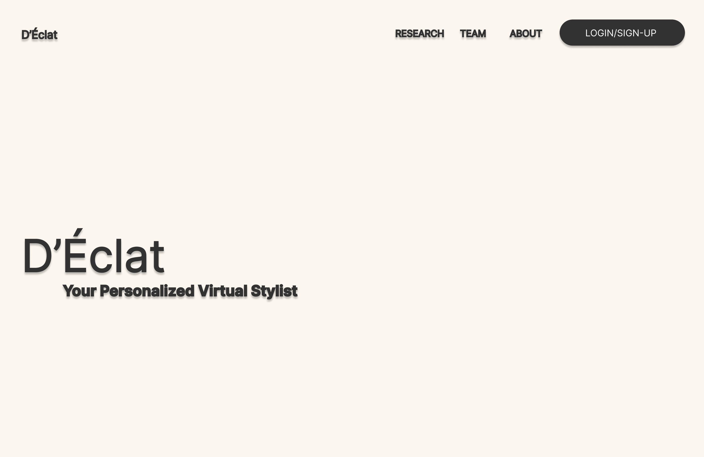
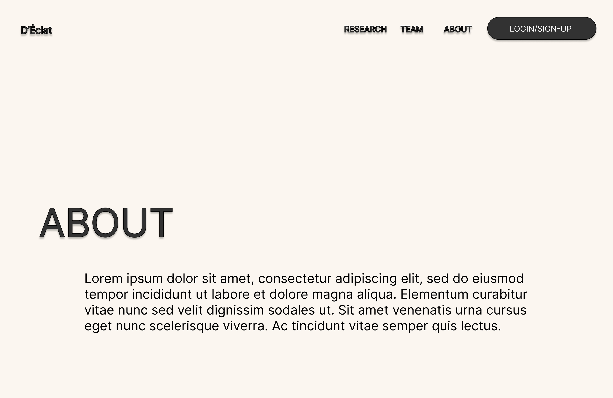
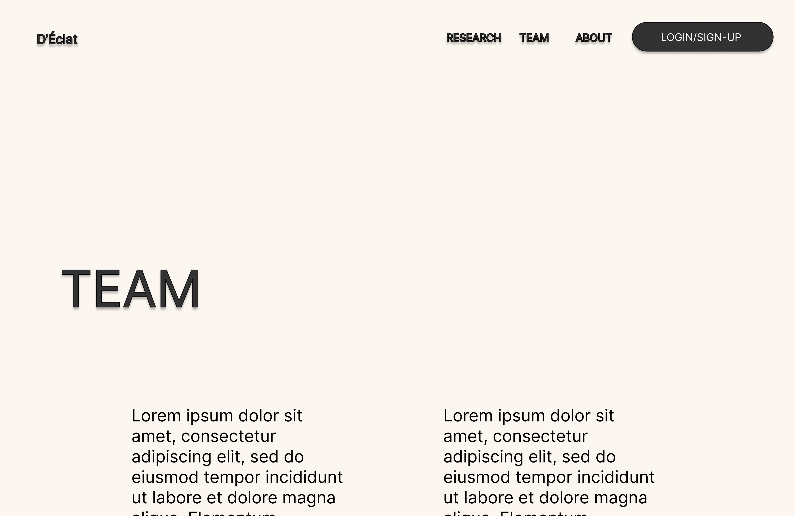
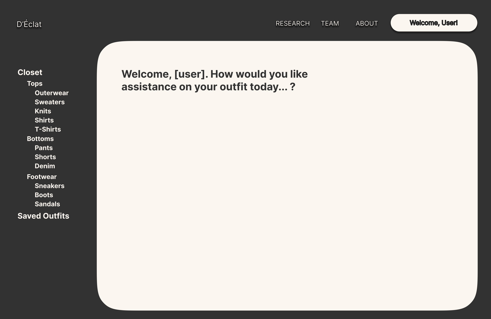

# D'Éclat Front-End Framework

## Overview
This is the overview of the front-end for our project. As stated on the main
[README](../README.md) file, the front-end of our project was built using
ReactJS. We also plan on using TailwindCSS to bootstrap the styling of our
web application. 

## Wireframe
We have a very simple... overall layout for our application. Below are some
images of our wireframe. We wanted to design a wireframe for the application
because, from past experience, coding with no design is practically
impossible. We decided to wireframe D'Éclat in Figma.

As prospective software engineers, we want to be able to create a design that
is friendly to look at (developer-wise), and be able to analyze it with
with respect to the design as well as the necessary tools needed to build the
application.

With that being said, below are some pictures of our Figma wireframe -

This is a picture of the landing page that users will see prior to logging in:

This is a picture of the teams page that users will see prior to logging in:

This is a picture of the about page that users will see prior to logging in:

And this is a picture of the interface once users log-in to the application:

The frame of the interface (last one) will be updated before that is 
implemented as well.

## Components
[As of now, we have not started coding this part of the application yet, so this will be empty until the front-end is being built.]
